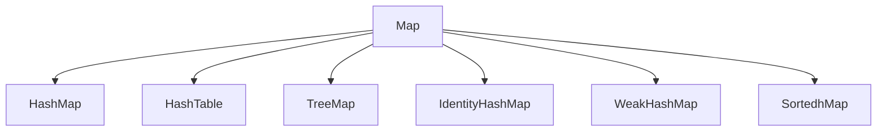

[TOC]

# Java集合(一) | Map集合之HashMap的介绍-上

# 前言

> 本文我们来共同探究Java集合，首先会介绍一些集合相关知识点的概念，如：**集合是什么**、**集合有哪些特点**、**集合的优劣之处**，然后探究的`java.util.Map`究竟是怎么样一个数据结构，并且通过`java.util.HashMap`作为切入点来走进Map集合的结构学习。

- 集合概述、特点、好处以及常见的集合
- `Map`的数据结构、原理
- `HashMap1.8`的源码分析
- `HashMap1.7`和`HashMap1.8`之间的区别

# 1. 集合容器概述

## 什么是集合
**集合框架**：为了保存数量不确定的数据，以及保存具有映射关系的数据（也被称为关联数组），Java提供了集合类用于存储数据的容器，集合类都位于 `java.util`包下。

>  集合框架是为表示和操作集合而规定的一种统一的标准的体系结构。任何集合框架都包含三大块内容：对外的接口、接口的实现和对集合运算的算法。

**接口**：表示集合的抽象数据类型。接口允许我们操作集合时不必关注具体实现，从而达到“多态”。在面向对象编程语言中，接口通常用来形成规范。

**实现**：集合接口的具体实现，是重用性很高的数据结构。

**算法**：某个集合框架接口的实现类汇中完成某种有用的操作的计算方法，例如查找、排序等。这些算法通常是多态的，因为相同的方法可以在同一个接口被多个类实现时有不同的表现。事实上，算法是可复用的函数。它减少了程序设计的辛劳。

> 集合框架通过**提供有用的数据结构和算法**使你能集中注意力于你的程序的重要部分上，而不是为了让程序能正常运转而将注意力于低层设计上。通过这些在无关API之间的简易的互用性，使你免除了为改编对象或转换代码以便联合这些API而去写大量的代码。 它提高了程序速度和质量。

## 集合和数组的区别
- 数组是固定长度的；集合可变长度的。

- 数组可以存储基本数据类型，也可以存储引用数据类型；**集合只能存储引用数据类型。**`基本数据类型存的是值 引用数据类型存的是地址`


- 数组存储的元素必须是同一个数据类型；集合存储的对象可以是不同数据类型。


## 使用集合框架的好处
1. 容量自增长；
2. 提供了高性能的数据结构和算法，使编码更轻松，提高了程序速度和质量；
3. 提供各类转换API，允许不同 API 之间的互操作，API之间可以来回传递集合；
4. 可以方便地扩展或改写集合，提高代码复用性和可操作性。

## 常用的集合类有哪些？
Java 容器分两大类，Map接口和Collection接口是所有集合框架的父接口：

- Collection 接口：该接口是最基本的集合接口，Collection接口的子接口包括：Queue接口、Set接口和List接口。

- List 接口：该接口继承了 Collection 接口，List 是有序集合，允许有相同的元素。使用 List 能够精确地控制每个元素插入的位置，用户能够使用索引（元素在List 中的位置，类似于数组下标）来访问 List 中的元素，与数组类似，List接口的实现类主要有：ArrayList、LinkedList、Stack以及Vector等


| 接口      | 底层数据结构 | 特点 |
| :-- | --- | --- |
| ArrayList | Object数组 | 顺序存取，查询快、增删慢、线程不安全、效率高。<br />默认长度是10 超过就会new一个新的数组50%延长` oldCapacity + (oldCapacity >> 1)`节省空间 |
| Vector    | Object数组 | 查询快、增删慢、线程安、 效率低 <br />默认长度是10 超过就会100%延长`oldCapacity + ((capacityIncrement > 0)? capacityIncrement:oldCapacity)` 变成20 浪费空间 |
| LinkedList | 双向循环链表 | 查询慢、增删快、线程不安全、效率高 |


- Set 接口：该接口也继承了 Collection 接口，它不能包含重复的元素，Set接口的实现类主要有：HashSet、TreeSet、LinkedHashSet等SortedSet 是按升序排列的 Set 集合。

| 接口      | 底层数据结构 | 特点 |
| :-- | --- | --- |
| HashSet | 哈希表 | 底层实现使用的`HashMap的key`做保证唯一，所以必须实现`hashCode()`和`equals()`两个方法 |
| LinkedHashSet | 数据结构是链表和哈希表 | FIFO插入有序、链表保证元素有序、哈希表保证元素唯一 |
| TreeSet | 红黑树 |  |

- Map 接口：包含键值对，Map 不能包含重复的键。SortedMap 是一个按升序排列的 Map 集合，Map接口的实现类主要有：HashMap、TreeMap、Hashtable、ConcurrentHashMap以及Properties等

| 接口      | 底层数据结构 | 特点 |
| :-- | --- | --- |
| HashMap | 数组+链表+红黑树 | 效率较高、但线程不安全 |
| TreeMap   | Map.Entry红黑树 | 查询快、增删慢、线程安、 效率低 <br />默认长度是10 超过就会100%延长`oldCapacity + ((capacityIncrement > 0)? capacityIncrement:oldCapacity)` 变成20 浪费空间 |
| Hashtable | 双向循环链表 | 效率较低、线程安全(使用`synchronized`)                       |


## 实现集合存储的基本数据结构


**数据结构**：就是容器中存储数据的方式。对于集合容器，有很多种。因为每一个容器的自身特点不同，其实原理在于每个容器的内部数据结构不同。在使用一个体系的原则：参阅顶层内容。建立底层对象。

**数组**：采用`一段连续的存储单元来存储数据`。对于指定下标的查找，时间复杂度为O(1)；通过给定值进行查找，需要遍历数组，逐一比对给定关键字和数组元素，时间复杂度为O(n)，当然，对于有序数组，则可采用二分查找，插值查找，斐波那契查找等方式，可将查找复杂度提高为O(logn)；对于一般的插入删除操作，涉及到数组元素的移动，其平均复杂度也为O(n)

**线性链表**：对于链表的新增，删除等操作（在找到指定操作位置后），仅需处理结点间的引用即可，时间复杂度为O(1)，而查找操作需要遍历链表逐一进行比对，复杂度为O(n)

**二叉树**：对一棵相对平衡的有序二叉树，对其进行插入，查找，删除等操作，平均复杂度均为O(logn)。

**哈希表**：相比上述几种数据结构，在哈希表中进行添加，删除，查找等操作，性能十分之高，不考虑哈希冲突的情况下（后面会探讨下哈希冲突的情况），仅需一次定位即可完成，时间复杂度为O(1)，接下来我们就来看看哈希表是如何实现达到惊艳的常数阶O(1)的。

我们知道，数据结构的物理存储结构只有两种：**顺序存储结构**和**链式存储结构**（像栈，队列，树，图等是从逻辑结构去抽象的，映射到内存中，也这两种物理组织形式），而在上面我们提到过，在数组中根据下标查找某个元素，一次定位就可以达到，哈希表利用了这种特性，**哈希表的主干就是数组**。

**哈希冲突**：

当我们对某个元素进行哈希运算，得到一个存储地址，然后要进行插入的时候，发现已经被其他元素占用了，其实这就是所谓的**哈希冲突**，也叫**哈希碰撞**。前面我们提到过，哈希函数的设计至关重要，**好的哈希函数会尽可能地保证计算简单和散列地址分布均匀**，但是，我们需要清楚的是，数组是一块连续的固定长度的内存空间，再好的哈希函数也不能保证得到的存储地址绝对不发生冲突。那么哈希冲突如何解决呢？

**哈希冲突的解决方案有多种**:

- 开放定址法（发生冲突，继续寻找下一块未被占用的存储地址），
- 散列函数法
- 链地址法，如HashMap即是采用了**链地址法**，也就是**数组+链表**的方式。


# 2.Map的简介

Map是一种**键值对集合**，每一个元素都包含一个键对象和一个值对象。其中键对象是不允许重复的。

Map接口与Collection接口是不同的，Map接口有三个主要实现类`java.util.HashMap`、`java.util.TreeMap`、`java.util.HashTable`，**HashMap类按哈希算法来存取键值对象，而TreeMap类可以对键值对象进行排序。**

- TreeMap是有序的，HashMap和HashTable是无序的。
- Hashtable的方法是同步的，HashMap的方法不是同步的，因此Hashtable是线程安全的，HashMap不是线程安全的



| 方法签名              | 说明                                                         |
| :-------------------- | ------------------------------------------------------------ |
| V get(Object key)     | 返回Map结合中指定键值对所对应的值                            |
| V put(K key, V value) | 向Map集合中添加键-值对，返回key以前对应的value，如果没有，则返回null |
| V remove(Object  key) | 从Map集合中删除key对应的键值对，返回key对应的value，如果没有则返回null |
| Set entrySet()        | 返回Map集合中所有键值对的Set集合，类型为Map内部类，Map.Entry |
| Set keySet()          | 返回Map集合中所有**键对象**的Set集合                         |

在java1.8以后采用**数组+链表+红黑树**的形势来进行存储，通过散列映射来存储键值对

* 对key的hashcode进行一个取模操作得到数组下标

* 数组存储的是一个单链表

* 数组下标相同将会被放在同一个链表中进行存储

* 元素是无序排列的

* 链表超过一定长度(`TREEIFY_THRESHOLD=8`)会转化为红黑树

* 红黑树在满足一定条件会再次退回链表

  

# HashMap原理

HashMap在我们Map接口的实现类中的使用中占有很高的频率，在初始化时将会给定`默认容量为16`,扩容的`加载因子为0.75`，当实例内的`结点数量>16*0.75`就会进行扩容，每次扩容都是`1<<2也就是2倍`。

> Hashmap不能用于多线程场景中，多线程下推荐使用concurrentHashmap！
>
> 原因在于扩容机制！扩容机制！扩容机制！  下文会进行仔细剖析

那么接下来怎们结合使用代码，对HashMap的数据结构进行深入剖析。

```java
Map hashMap=new HashMap(3);
hashMap.put("小林",666);
hashMap.put("小马",777);
```

那么在咱们HashMap中数据结构就应该只存了一个Node


其中这个`Node[]数组的index`是通过key对象的hash值取模得出的，源码公式采用位运算`(length-1)&hash`取模然后放置到Node数组的`Node[(length-1)&hash]`。

当然如果**小林和小马的hash值可能相同(`发生哈希碰撞`)**，则将会在小林的出追加一个结点，形成了链表。


在追加节点时成为链表，那么这里就会分为**头插法**和**尾插法**了。

## 头插法

首先我们声明下**单向链表结点**

```java

    class ListNode {
        //结点上存储的数据
        int val;
        //单向链表指针
        ListNode next;

        ListNode() {
        }
        ListNode(int val) {
            this.val = val;
        }
        ListNode(int val, ListNode next) {
            this.val = val;
            this.next = next;
        }
        public void setVal(int val) {
            this.val = val;
        }

        public ListNode getNext() {
            return next;
        }

        public void setNext(ListNode next) {
            this.next = next;
        }
    }
```

接下来使用头插法进行数据存储

```java
	class List {
        // 头结点
        private ListNode headNode = new ListNode();
       /**
         * 头插法
         */
        public boolean headInsert(int val) {
            // 实例化新节点，也就是待插入结点
            ListNode node = new ListNode();
            // 先放入value对象
            node.setVal(val);
            // 待插入结点next指针指向头结点next指针域
            node.setNext(headNode.getNext());
            // 头结点指针指向待插入结点
            headNode.setNext(node);
            // 判断是否指向成功
            if (headNode.getNext()==node){
                return true;
            }
            return false;
        }
    }
```

头插法单向链表的插入动作如下图


## 尾插法

还是以上方头插法的结点数据结构为基础，咱们来简单表示下尾插法

```java
   class List {
        // 尾结点
        private ListNode tailNode = new ListNode();
        /**
         * 尾插法
         */
        public boolean tailInsert(int val) {
            // 实例化新节点，也就是待插入结点
            ListNode node = new ListNode();
            // 先放入value对象
            node.setVal(val);
            // 尾结点指针指向待插入结点
            tailNode.setNext(node);
            // 尾结点直接改变为当前插入的节点
            tailNode=node;
            // 判断尾结点是否是当前节点
            if (tailNode.getNext()==null){
                return true;
            }
            return false;
        }
    }
```

尾插法动作如下图


## 为什么Java8要使用尾插法呢

在Java7中Map的链表新增还是头插法，而在Java8中使用的就是尾插法了，其原因有两个：

* 头插法会造成死链
* Java7考虑是热点数据可能会更早的用到，**如果发生链表迁移，头插法还是会扰乱插入的顺序**

# 内部重要属性

```java
     /**
     * 默认初始化容量，值为16，必须是2的n次方
     */
    static final int DEFAULT_INITIAL_CAPACITY = 1 << 4; // aka 16
    
    /**
     * 默认加载因子
     * 当size>capacity*DEFAULT_LOAD_FACTOR时则进行resize(扩容)
     */
    static final float DEFAULT_LOAD_FACTOR = 0.75f;  
    
    /**
     * 链表需要转红黑树时的长度。
     * 此时未必会做换红黑树的操作，需要结合MIN_TREEIFY_CAPACITY，即链表长度达到8且容量达到64时，才会做红黑树的转换；
     * 否则，进行扩容操作。
     */
    static final int TREEIFY_THRESHOLD = 8;    
    
    /**
     * 红黑树转链表时的元素个数
     */
    static final int UNTREEIFY_THRESHOLD = 6;


    /**
     * 链表树形化，最小数组容量阈值
     * 数组容量超过这个，链表将会树形化
     */
    static final int MIN_TREEIFY_CAPACITY = 64;        
```

## 不同类型结点结构

无论是`LinkedMap`还是`HashMap`内部都离不开`Node`节点、这是我们数据存储的最基本结构，在Java7叫`Entry`，在Java8叫`Node`，其本质都是`Map.Entry`的实现，但其内部结构却不太一样，可能是HashMap中是链表，LinkedMap中是双向链表，在TreeMap中可以排序，又可以是红黑树。

```java
    /**
     * 链表结点，实现Map.Entry接口
     */
    static class Node<K,V> implements Map.Entry<K,V> {
        final int hash;
        final K key;
        V value;
        Node<K,V> next;
        
        // ... 
    }
    
    /**
     * LinkedHashMap中元素的结点类型
     */
    static class Entry<K,V> extends HashMap.Node<K,V> {
        Entry<K,V> before, after;
        Entry(int hash, K key, V value, Node<K,V> next) {
            super(hash, key, value, next);
        }
    }    
    
    /**
     * 红黑树结点，继承了LinkedHashMap.Entry，间接继承了HashMap.Node，所以也具有链表的性质。
     * 实际上该结点类型既可以作为红黑树结点，又可以作为双向链表结点。
     */
    static final class TreeNode<K,V> extends LinkedHashMap.Entry<K,V> {
        TreeNode<K,V> parent;  // red-black tree links
        TreeNode<K,V> left;
        TreeNode<K,V> right;
        TreeNode<K,V> prev;    // needed to unlink next upon deletion
        boolean red;
        
        // ...
    }    
```

# HashMap中的重要操作

在HashMap中，我们常用到`get`、`set`这些操作，但除了这些操作还有一些其他的`链表转红黑树`、`红黑树转链表`等一系列扩容或者是迭代的其他操作，通过这些操作影响着HashMap的内部结构，同时这也是HashMap之所以**线程不安全**、**性能比较高**的原因。

## HashMap实例化

```java
     /**
     * 可以通过构造参数，指定当前新Map的初始化容量
     * @param  initialCapacity 初始化容量
     * @param  loadFactor      影响扩容的加载因子
     */
    public HashMap(int initialCapacity, float loadFactor) {
        if (initialCapacity < 0)
            throw new IllegalArgumentException("Illegal initial capacity: " +
                                               initialCapacity);
        if (initialCapacity > MAXIMUM_CAPACITY)
            initialCapacity = MAXIMUM_CAPACITY;
        if (loadFactor <= 0 || Float.isNaN(loadFactor))
            throw new IllegalArgumentException("Illegal load factor: " +
                                               loadFactor);
        this.loadFactor = loadFactor;
        this.threshold = tableSizeFor(initialCapacity);
    }
    /**
     * Constructs a new <tt>HashMap</tt> with the same mappings as the
     * specified <tt>Map</tt>.  The <tt>HashMap</tt> is created with
     * default load factor (0.75) and an initial capacity sufficient to
     * hold the mappings in the specified <tt>Map</tt>.
     *
     * @param   m the map whose mappings are to be placed in this map
     * @throws  NullPointerException if the specified map is null
     */
    public HashMap(Map<? extends K, ? extends V> m) {
        this.loadFactor = DEFAULT_LOAD_FACTOR;
        putMapEntries(m, false);
    }
```


## put新增结点

```java
	public V put(K key, V value) {
        return putVal(hash(key), key, value, false, true);
    }

    /**
     * Implements Map.put and related methods
     *
     * @param hash 键对象的hash值
     * @param key 键对象
     * @param value 键值对中的值对象，主要就是用于存储这个对象
     * @param onlyIfAbsent 如果同样的键对象是否替换当前已存在的值对象
     * @param evict if false, the table is in creation mode.
     * @return 如果是替换的话则返回oldValue，否则返回null
     */
    final V putVal(int hash, K key, V value, boolean onlyIfAbsent,
                   boolean evict) {
        Node<K,V>[] tab; Node<K,V> p; int n, i;
        if ((tab = table) == null || (n = tab.length) == 0)
            n = (tab = resize()).length;
        if ((p = tab[i = (n - 1) & hash]) == null)
            tab[i] = newNode(hash, key, value, null);
        else {
            Node<K,V> e; K k;
            if (p.hash == hash &&
                ((k = p.key) == key || (key != null && key.equals(k))))
                e = p;
            else if (p instanceof TreeNode)
                e = ((TreeNode<K,V>)p).putTreeVal(this, tab, hash, key, value);
            else {
                for (int binCount = 0; ; ++binCount) {
                    if ((e = p.next) == null) {
                        p.next = newNode(hash, key, value, null);
                        if (binCount >= TREEIFY_THRESHOLD - 1) // -1 for 1st
                            treeifyBin(tab, hash);
                        break;
                    }
                    if (e.hash == hash &&
                        ((k = e.key) == key || (key != null && key.equals(k))))
                        break;
                    p = e;
                }
            }
            if (e != null) { // existing mapping for key
                V oldValue = e.value;
                if (!onlyIfAbsent || oldValue == null)
                    e.value = value;
                afterNodeAccess(e);
                return oldValue;
            }
        }
        ++modCount;
        if (++size > threshold)
            resize();
        afterNodeInsertion(evict);
        return null;
    }
```


## treeifyBin树形化链表

```java

    /**
     * 当达到两个阈值后，替换所有数组上的链表节点
     */
    final void treeifyBin(Node<K,V>[] tab, int hash) {
        int n, index; Node<K,V> e;
        if (tab == null || (n = tab.length) < MIN_TREEIFY_CAPACITY)
            resize();
        else if ((e = tab[index = (n - 1) & hash]) != null) {
            TreeNode<K,V> hd = null, tl = null;
            do {
                TreeNode<K,V> p = replacementTreeNode(e, null);
                if (tl == null)
                    hd = p;
                else {
                    p.prev = tl;
                    tl.next = p;
                }
                tl = p;
            } while ((e = e.next) != null);
            if ((tab[index] = hd) != null)
                hd.treeify(tab);
        }
    }
```


# resize扩容

Node数组的容量是优先的，当数据多次插入达到一定数量就会进行扩容`resize()`

**那什么时候进行resize呢**，有两个因素

* Capacity：HashMap当前的容量
* LoadFactor：负载因子

当Map的长度大于`capacity * load factor`，如容量为16时，当Map中节点数量超过12则需要进行扩容，那么怎么扩容呢？

1. 判断旧数组的容量是否大于等于最大容量`1<<30`，将新**数组容量**和**阈值**参数扩大2倍

   ```java
           Node<K,V>[] oldTab = table;
   		//判断当前数组的长度，如果是0则新建数组，容量和负载因子都是默认值16*0.75
           int oldCap = (oldTab == null) ? 0 : oldTab.length;
           int oldThr = threshold;
           int newCap, newThr = 0;
   		//判断当前数组是否有容量，且不超过最大容量1<<30
           if (oldCap > 0) {
               if (oldCap >= MAXIMUM_CAPACITY) {
                   threshold = Integer.MAX_VALUE;
                   return oldTab;
               }
               //若有容量，并且新扩容的容量值没有超过最大容量值，则将阈值和容量扩大二倍，也就是容量总是2的幂次方
               else if ((newCap = oldCap << 1) < MAXIMUM_CAPACITY &&
                        oldCap >= DEFAULT_INITIAL_CAPACITY)
                   newThr = oldThr << 1; // double threshold
           }
           else if (oldThr > 0) // initial capacity was placed in threshold
               newCap = oldThr;
           else {               // zero initial threshold signifies using defaults
               //如果阈值为0则使用默认值
               newCap = DEFAULT_INITIAL_CAPACITY;
               newThr = (int)(DEFAULT_LOAD_FACTOR * DEFAULT_INITIAL_CAPACITY);
           }
           if (newThr == 0) {
               float ft = (float)newCap * loadFactor;
               newThr = (newCap < MAXIMUM_CAPACITY && ft < (float)MAXIMUM_CAPACITY ?
                         (int)ft : Integer.MAX_VALUE);
           }
           threshold = newThr;
   ```

   2. 根据新阈值创建新数组

      ```java
      		//根据新容量参数，创建一个新数组
      		Node<K,V>[] newTab = (Node<K,V>[])new Node[newCap];
      		//Node数组引用指向新数组
              table = newTab;
              if (oldTab != null) {
                  for (int j = 0; j < oldCap; ++j) {
                      Node<K,V> e;
                      if ((e = oldTab[j]) != null) {
                          oldTab[j] = null;
                          if (e.next == null)// 表示j下标处只有一个结点
                              //根据新数组的容量值，取模计算在新数组中的位置
                              newTab[e.hash & (newCap - 1)] = e;
                          else if (e instanceof TreeNode)
                              // 将红黑树分解为两个双向链表，如果双向链表长度大于6，则分解出来的双向链表转换为红黑树。
                              // 然后将双向链表或红黑树放入新table的相应下标处
                              ((TreeNode<K,V>)e).split(this, newTab, j, oldCap);
                          else { // preserve order
                              //将原链表拆分为两个（至少一个）链表，并且维持元素在原链表中的相对顺序
                              Node<K,V> loHead = null, loTail = null;
                              Node<K,V> hiHead = null, hiTail = null;
                              Node<K,V> next;
                              do {
                                  next = e.next;
                                  if ((e.hash & oldCap) == 0) {
                                      if (loTail == null)
                                          loHead = e;
                                      else
                                          loTail.next = e;
                                      loTail = e;
                                  }
                                  else {
                                      if (hiTail == null)
                                          hiHead = e;
                                      else
                                          hiTail.next = e;
                                      hiTail = e;
                                  }
                              } while ((e = next) != null);
                              if (loTail != null) {
                                  loTail.next = null;
                                  // 将新的链表放入新table的相应下标处
                                  newTab[j] = loHead;
                              }
                              if (hiTail != null) {
                                  hiTail.next = null;
                                  newTab[j + oldCap] = hiHead;
                              }
                          }
                      }
                  }
              }
              return newTab;
      ```

      

## get获取Value对象

返回key关联的value值；如果key不存在，返回null。

1. 计算key的hash值，根据hash值计算key在table数组中的位置

- 如果该位置不为null，则比较key和其hash值是否相等

- 如果相等，则返回该结点

- 否则
  - 如果结点是红黑树，则从红黑树中查找该key对应的结点
  - 否则，就是从链表中查找该key对应的结点
    + 否则，返回null

1. 根据1获取结点的value值，或者返回null

```java
    public V get(Object key) {
        Node<K,V> e;
        return (e = getNode(hash(key), key)) == null ? null : e.value;
    }

    /**
     * 实现了Map接口的get方法
     */
    final Node<K,V> getNode(int hash, Object key) {
        Node<K,V>[] tab; Node<K,V> first, e; int n; K k;
        if ((tab = table) != null && (n = tab.length) > 0 &&
            //哈希值取模后在数组中存在至少一个节点，在该index位置有一个Node存在
            (first = tab[(n - 1) & hash]) != null) {
            if (first.hash == hash && // always check first node
                ((k = first.key) == key || (key != null && key.equals(k))))
                return first;
            if ((e = first.next) != null) {
                //如果链表的头结点不是目标元素，则判断是不是树形化的节点
                if (first instanceof TreeNode)
                    return ((TreeNode<K,V>)first).getTreeNode(hash, key);
                do {
                    //遍历这个链表，一直到找到key和hash值都相同的节点
                    if (e.hash == hash &&
                        ((k = e.key) == key || (key != null && key.equals(k))))
                        return e;
                } while ((e = e.next) != null);
            }
        }
        return null;
    }
```


## remove删除key对象

删除key，返回key关联的value；如果key不存在，返回null

1. 查找key对应的结点

2. 从链表或者红黑树删除该结点

```java
    public V remove(Object key) {
        Node<K,V> e;
        return (e = removeNode(hash(key), key, null, false, true)) == null ?
            null : e.value;
    }

    /**
     * 实现了Map接口中remove方法
     */
    final Node<K,V> removeNode(int hash, Object key, Object value,
                               boolean matchValue, boolean movable) {
        Node<K,V>[] tab; Node<K,V> p; int n, index;
        if ((tab = table) != null && (n = tab.length) > 0 &&
            (p = tab[index = (n - 1) & hash]) != null) {
            Node<K,V> node = null, e; K k; V v;
            if (p.hash == hash &&
                ((k = p.key) == key || (key != null && key.equals(k))))
                node = p;
            else if ((e = p.next) != null) {
                if (p instanceof TreeNode)
                    node = ((TreeNode<K,V>)p).getTreeNode(hash, key);
                else {
                    do {
                        if (e.hash == hash &&
                            ((k = e.key) == key ||
                             (key != null && key.equals(k)))) {
                            node = e;
                            break;
                        }
                        p = e;
                    } while ((e = e.next) != null);
                }
            }
            if (node != null && (!matchValue || (v = node.value) == value ||
                                 (value != null && value.equals(v)))) {
                if (node instanceof TreeNode)
                    ((TreeNode<K,V>)node).removeTreeNode(this, tab, movable);
                else if (node == p)
                    tab[index] = node.next;
                else
                    p.next = node.next;
                ++modCount;
                --size;
                afterNodeRemoval(node);
                return node;
            }
        }
        return null;
    }
```

-------

## 什么情况下会进行扩容？

* size属性 > 数组容量 * 加载因子时

* 为解决hash冲突而形成的链表长度 >= TREEIFY_THRESHOLD（8），但是table数组长度 <= MIN_TREEIFY_CAPACITY（64）时

## 什么情况下会进行转红黑树操作？

* 为解决hash冲突而形成的链表长度 >= TREEIFY_THRESHOLD（8），并且table数组长度 > MIN_TREEIFY_CAPACITY（64）时

* 在扩容时，如果从原红黑树拆解出的新的链表长度 >= TREEIFY_THRESHOLD（8）

## 为什么是非线程安全的？

为了性能及安全。在多线程环境下，请使用ConcurrentHashMap

* 如果多线程写HashMap实例，会有什么问题？

1. 多线程put（不考虑resize） 

   如果hash冲突，后一个线程覆盖前一个线程的key-value，如在一系列线程中出现hash冲突的键值对个数为N，则最多可能丢失N-1个键值对，即只有一个线程的键值对最终被加入到table内的链表或红黑树中

2. 多线程resize

   A、B线程执行顺序如下

   A线程

   1. oldTab = table; // 赋值旧数组的引用
   2. Node<K,V>[] newTab = (Node<K,V>[])new Node[newCap]; // 创建扩容后的数组
   3. table = newTab; // 将新数组赋值给旧数组
   4. 将oldTab中的全部元素放入newTab // A线程还未执行到这里

   B线程

   1. oldTab = table; // B线程拿到的table实际上是A线程刚创建的没有任何元素的newTab
   2. Node<K,V>[] newTab = (Node<K,V>[])new Node[newCap]; // 创建扩容后的数组
   3. table = newTab; // 将新数组赋值给旧数组，这里会覆盖掉A线程创建的newTable
   4. 将oldTab中的全部元素放入newTab // B线程先于A线程执行完这一步骤，oldTab中没有任何元素，所以newTab中也不会有任何元素，即table中也不会有任何元素。这样，元素就全部丢失了

   以上是全部丢失的情况，如果在A线程执行步骤4的过程中，B线程开始执行上述逻辑，那么有可能不会丢失全部元素，而是丢失A线程还未放入newTable的部分元素。

3. 多线程remove