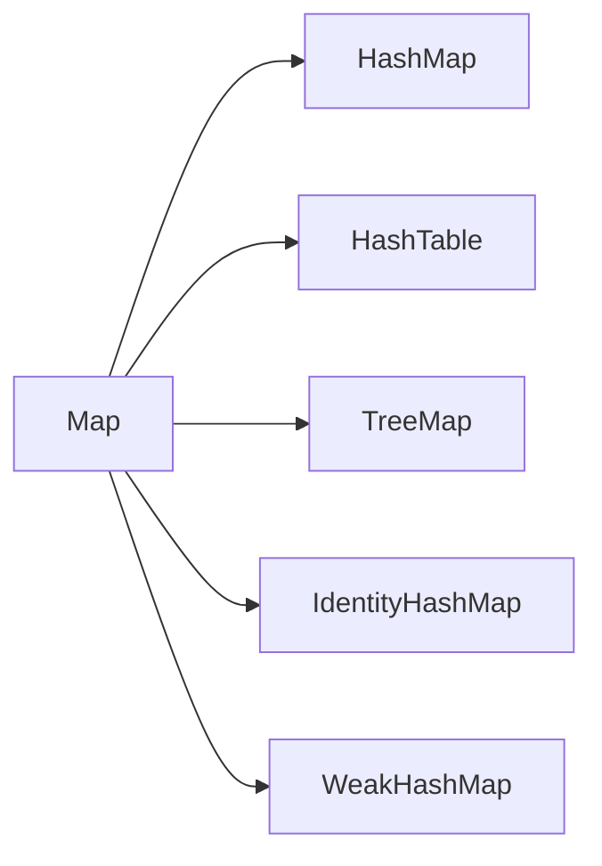
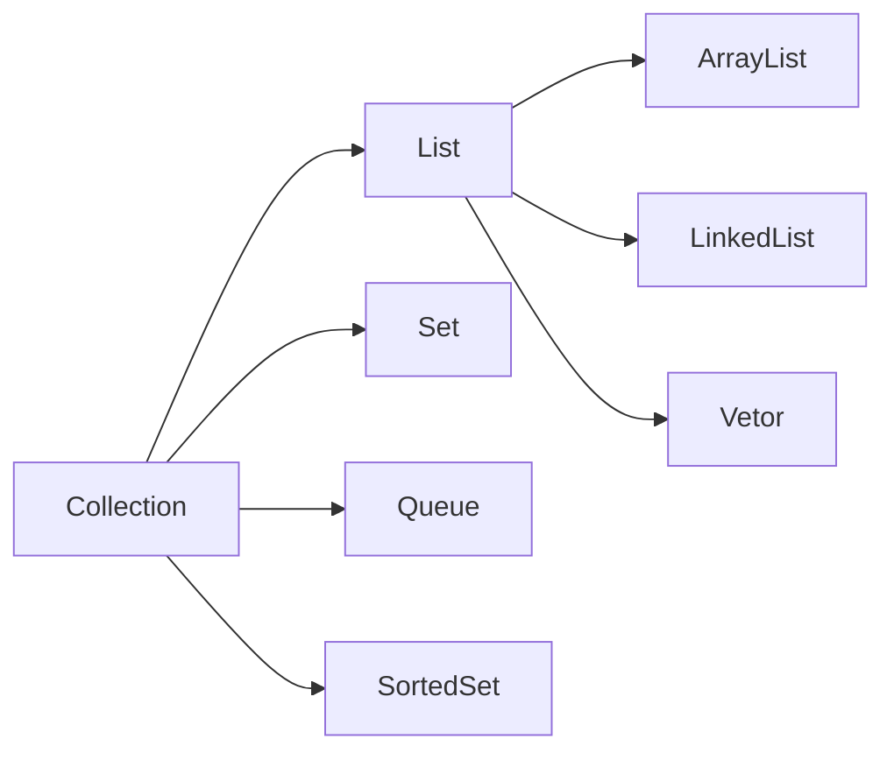

# 集合Map简单介绍

Map是一种**键值对集合**，每一个元素都包含一个键对象和一个值对象。其中键对象是不允许重复的。

Map接口与Collection接口是不同的，Map接口有两个主要实现类`HashMap类`、`TreeMap类`，**HashMap类按哈希算法来存取键值对象，而TreeMap类可以对键值对象进行排序。**
<!--more-->





| 方法签名              | 说明                                                         |
| :-------------------- | ------------------------------------------------------------ |
| V get(Object key)     | 返回Map结合中指定键值对所对应的值                            |
| V put(K key, V value) | 向Map集合中添加键-值对，返回key以前对应的value，如果没有，则返回null |
| V remove(Object  key) | 从Map集合中删除key对应的键值对，返回key对应的value，如果没有则返回null |
| Set entrySet()        | 返回Map集合中所有键值对的Set集合，类型为Map内部类，Map.Entry |
| Set keySet()          | 返回Map集合中所有**键对象**的Set集合                         |

在java1.8以后采用**数组+链表+红黑树**的形势来进行存储，通过散列映射来存储键值对

* 对key的hashcode进行一个取模操作得到数组下标

* 数组存储的是一个单链表

* 数组下标相同将会被放在同一个链表中进行存储

* 元素是无序排列的

* 链表超过一定长度(`TREEIFY_THRESHOLD=8`)会转化为红黑树

* 红黑树在满足一定条件会再次退回链表

  

## 内部重要属性

```java
     /**
     * 默认初始化容量，值为16，必须是2的n次方
     */
    static final int DEFAULT_INITIAL_CAPACITY = 1 << 4; // aka 16
    
    /**
     * 默认加载因子
     * 当size>capacity*DEFAULT_LOAD_FACTOR时则进行resize(扩容)
     */
    static final float DEFAULT_LOAD_FACTOR = 0.75f;  
    
    /**
     * 链表需要转红黑树时的长度。
     * 此时未必会做换红黑树的操作，需要结合MIN_TREEIFY_CAPACITY，即链表长度达到8且容量达到64时，才会做红黑树的转换；
     * 否则，进行扩容操作。
     */
    static final int TREEIFY_THRESHOLD = 8;    
    
    /**
     * 红黑树转链表时的元素个数
     */
    static final int UNTREEIFY_THRESHOLD = 6;


    /**
     * 链表树形化，最小数组容量阈值
     * 数组容量超过这个，链表将会树形化
     */
    static final int MIN_TREEIFY_CAPACITY = 64;        
```

## 不同类型结点结构

```java
    /**
     * 链表结点，实现Map.Entry接口
     */
    static class Node<K,V> implements Map.Entry<K,V> {
        final int hash;
        final K key;
        V value;
        Node<K,V> next;
        
        // ... 
    }
    
    /**
     * LinkedHashMap中元素的结点类型
     */
    static class Entry<K,V> extends HashMap.Node<K,V> {
        Entry<K,V> before, after;
        Entry(int hash, K key, V value, Node<K,V> next) {
            super(hash, key, value, next);
        }
    }    
    
    /**
     * 红黑树结点，继承了LinkedHashMap.Entry，间接继承了HashMap.Node，所以也具有链表的性质。
     * 实际上该结点类型既可以作为红黑树结点，又可以作为双向链表结点。
     */
    static final class TreeNode<K,V> extends LinkedHashMap.Entry<K,V> {
        TreeNode<K,V> parent;  // red-black tree links
        TreeNode<K,V> left;
        TreeNode<K,V> right;
        TreeNode<K,V> prev;    // needed to unlink next upon deletion
        boolean red;
        
        // ...
    }    
```


# ConcurrentHashMap

## 简述

## 保证并发

# 多线程场景和使用

核心线程数，最大线程数，任务队列

# Tomcat默认核心线程池是200

IO 密集型和计算密集型

# JVM内存模型

S0和S1比例是8:1:1

# Java的内存泄漏

内存泄漏的定义：**GC无法回收内存中不再使用的对象，则定义为内存有泄漏**

什么时候存在内存泄漏的代码：ThreadLocal没有clear会造成


# ThreadLocal简单介绍

定时任务Qurzt和ThreadExecutorPool


