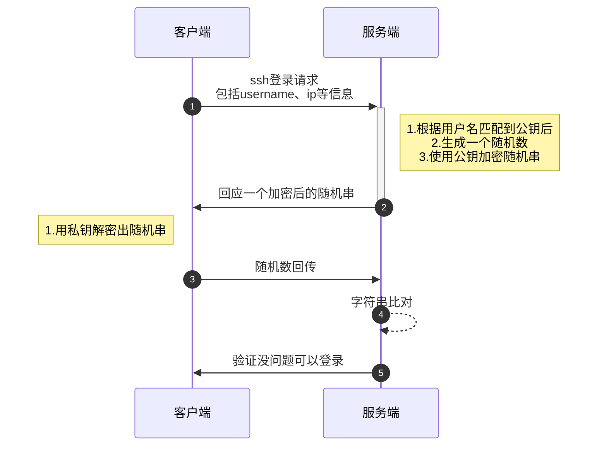

[TOC]

# ssh-keygen密钥是什么

密钥是一对由非对称加密方法生成的 `公钥(public key)` 和 `私钥(private key)`，且每次生成后的公钥和私钥都是以一一对应，每个公钥有且仅有一个私钥。

其中**公钥是可以公开发送的**，使用公钥加密的信息**必须使用对应的私钥才可以解密**。

既然是**非对称加密**，那么这个非对称加密体现在哪里呢？


# 使用密钥登录过程

1. 客户端发送请求，带上`username`、`ip`等重要信息
2. 服务端接收到请求后生成一个随机串，在 `authorized_keys` 文件中根据`username`匹配出对应的公钥，并使用公钥加密随机串后回传给客户端

3. 客户端接收到密文，使用自己的私钥进行解密，获得随机串，传给服务端以证清白
4. 服务端将收到的随机串进行比对，没毛病后放行




# ssh-keygen密钥生成

在登录之前需要生成一对公私钥，无论是**github鉴权**、**ssh鉴权**都将有可能用到这个。

打开终端使用`ssh-keygen`命令生成密钥，`-t`用于指定密钥的加密算法，一般可使用`DSA`或`RSA`算法，`-C`用来指定标识邮箱

```bash
$ ssh-keygen -t dsa -C "youremail@doamin.com"
Generating public/private dsa key pair.
Enter file in which to save the key (/home/username/.ssh/id_dsa):  press ENTER
Enter passphrase (empty for no passphrase): ********
Enter same passphrase again: ********
Your identification has been saved in /home/username/.ssh/id_dsa.
Your public key has been saved in /home/username/.ssh/id_dsa.pub.
The key fingerprint is:
14:ba:06:98:a8:98:ad:27:b5:ce:55:85:ec:64:37:19 youremail@doamin.com
```

在执行完`ssh-keygen -t dsa`命令后将会如上所示，需要输入两个东西，当然这两个选项也可以不输入

`Enter file in which to save the key (/home/username/.ssh/id_dsa):`这里是输入您所期望密钥对生成后的目录，默认情况下可以在`$HOME/.ssh`目录下找到，需要注意点的是，root用户与其他用户目录稍稍有点不同，其他用户在`/home/$username/.ssh`目录下，而root目录在`/root/.ssh/`。

输入完目录后，`Enter passphrase (empty for no passphrase):`，输入加密的口令*最短五个字符*,这里我的理解就是随意输入一个加密的串，当然也可以不输入，默认空串

最后我们可以看到提示已经生成了密钥对，公钥指纹和邮箱标识，根据`/home/username/.ssh/id_dsa.pub`我们可以查看一下公钥，这里密钥对都是文本文件，可以使用`vi`直接打开。

```bash
$ vi /home/username/.ssh/id_dsa.pub
ssh-rsa AAAAB3NzaC1yc2EAAAABIwAAAIEAvpB4lUbAaEbh9u6HLig7amsfywD4fqSZq2ikACIUBn3GyRPfeF93l/
weQh702ofXbDydZAKMcDvBJqRhUotQUwqV6HJxqoqPDlPGUUyo8RDIkLUIPRyq
ypZxmK9aCXokFiHoGCXfQ9imUP/w/jfqb9ByDtG97tUJF6nFMP5WzhM= youremail@doamin.com
```

由于我们使用的`dsa`算法，因此公钥名称将会是`id_dsa.pub`，如果我们使用`rsa`算法的话，那名称应该是`id_rsa.pub`

下面的命令可以列出用户所有的公钥。

```bash
$ ls -l ~/.ssh/id_*.pub
```

生成密钥以后，建议修改它们的权限，防止其他人读取。

```bash
$ chmod 600 ~/.ssh/id_rsa
$ chmod 600 ~/.ssh/id_rsa.pub
```

> chmod 是一个更改文件权限的命令，使用数字比较方便但不太好记，每位数字代表不同的域
>
> 第一位代表文件或目录所属用户、第二位代表文件或目录所属用户组、第三位代表其他所有用户
>
> + 可运行 +x 数字代表是 1
> + 可写 +w 数字代表是 2
> + 可读 +r 数字代表是4
>
> 因此 6=2+4 即为只能读写


# 使用密钥对免密登录的步骤

1. 客户端使用`ssh-keygen`生成密钥对，命令可以使用`ssh-keygen -t rsa -C "youremail@doamin.com"，输入指纹是可选的。
2. 将公钥`id_rsa.pub`复制到目标服务器（服务端）`$HOME/.ssh`目录下，并更名为 `authorized_keys`
3. 重启目标服务器的ssh服务，这点很重要，可以使用`systemctl restart sshd`
4. 客户端再次发送`ssh username@hostname`即可直接登录


# ssh-copy-id 命令：自动上传公钥一步到位

```bash
$ ssh-copy-id -i key_file username@host
```

上述命令中`key_file`就是公钥，`username`和`host`可以不用说了吧[手动狗头]，当然如果像我一样懒，不想使用`-i`去指定公钥，比如只有一个`$HOME/.ssh/id_rsa.pub`，那么也可以不需要指定`key_file`，`ssh-copy-id`会自动在当前`$HOME/.ssh/`目录下匹配到公钥，然后发送到远程计算机上，命令使用如下：

```bash
$ ssh-copy-id username@host
/usr/bin/ssh-copy-id: INFO: Source of key(s) to be installed: "/root/.ssh/id_rsa.pub"
/usr/bin/ssh-copy-id: INFO: attempting to log in with the new key(s), to filter out any that are already installed
/usr/bin/ssh-copy-id: INFO: 1 key(s) remain to be installed -- if you are prompted now it is to install the new keys
```

通过上述提示，咱们可以看出来`ssh-copy-id`命令回去检索需要安装到远程计算机的公钥，并将没安装的密钥进行自动安装，完成了密钥复制、远程计算机内更名公钥为`authorized_keys`或在`authorized_keys`文件最后一行追加客户端公钥。

此处需要注意若`authorized_keys`文件是存在的，那么需要**保证文件的末尾是换行符**，否则将可能出现多个公钥连在一起，使多个公钥均无法生效


# ssh-agent和ssh-add命令使用

## ssh-agent将口令保存在内存中

这两个命令可能会陌生一些，但也是咱们使用非对称密钥传输的重要工具，通常是在**密钥对生成时私钥（`private key`）增加了口令，因此无论是`scp`/`sftp`/`ssh`均需要在私钥解密前，输入对应的口令。

每次使用私钥均需要输入口令，那不又回到最初的原点了，`ssh-agent`和`ssh-add`就是来带你走出原点而设计的。

第一步，使用下面的命令新建一次命令行对话。

```bash
$ ssh-agent bash
```

上面命令中，如果你使用的命令行环境不是 Bash，可以用其他的 Shell 命令代替。比如`zsh`和`fish`。

如果想在当前对话启用`ssh-agent`，可以使用下面的命令。

```bash
$ eval `ssh-agent`
Agent pid 8627
```

上面命令中，`ssh-agent`会先自动在后台运行，并将需要设置的环境变量输出在屏幕上，类似下面这样。

```bash
$ ssh-agent
SSH_AUTH_SOCK=/tmp/ssh-8nNIF0cc0eJn/agent.8934; export SSH_AUTH_SOCK;
SSH_AGENT_PID=8935; export SSH_AGENT_PID;
echo Agent pid 8935;
```

`eval`命令的作用，就是运行上面的`ssh-agent`命令的输出，设置环境变量。

第二步，在新建的 Shell 对话里面，使用`ssh-add`命令添加默认的私钥（比如`~/.ssh/id_rsa`，或`~/.ssh/id_dsa`，或`~/.ssh/id_ecdsa`，或`~/.ssh/id_ed25519`）。

```bash
$ ssh-add
Enter passphrase for /home/you/.ssh/id_dsa: ********
Identity added: /home/you/.ssh/id_dsa (/home/you/.ssh/id_dsa)
```

上面例子中，添加私钥时，会要求输入密码。以后，在这个对话里面再使用密钥时，就不需要输入私钥的密码了，因为私钥已经加载到内存里面了。

第三步，使用 ssh 命令正常登录远程服务器。

```bash
$ ssh username@remoteHost
```

上面命令中，`remoteHost`是远程服务器的地址，ssh 使用的是默认的私钥。这时如果私钥设有密码，ssh 将不再询问密码，而是直接取出内存里面的私钥。

如果要使用其他私钥登录服务器，需要使用 ssh 命令的`-i`参数指定私钥文件。

```bash
$ ssh –i OpenSSHPrivateKey remoteHost
```

最后，如果要退出`ssh-agent`，可以直接退出子 Shell（按下 Ctrl + d），也可以使用下面的命令。

```bash
$ ssh-agent -k
```

## ssh-add对私钥口令的操作

如果添加的不是默认私钥，`ssh-add`命令需要显式指定私钥文件

```bash
$ ssh-add my-other-key-file
```

`my-other-key-file`就是用户指定的私钥文件。

1. **`-d`参数从内存中删除指定的私钥。**

```bash
$ ssh-add -d name-of-key-file
```

2. **`-D`参数从内存中删除所有已经添加的私钥。**

```bash
$ ssh-add -D
```

3. **`-l`参数列出所有已经添加的私钥。**

```bash
$ ssh-add -l
```
